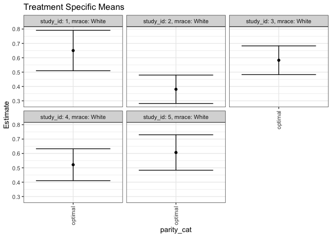

## Methods
## Outcome Variable

**Outcome Variable:** haz

## Predictor Variables

**Intervention Variable:** parity_cat

**Adjustment Set:**

unadjusted

## Stratifying Variables

The analysis was stratified on these variable(s):

* study_id
* mrace

## Data Summary

 study_id  mrace   parity_cat    n_cell     n
---------  ------  -----------  -------  ----
        1  Black   [0,1)              4    26
        1  Black   [1,2)              8    26
        1  Black   [2,3)              6    26
        1  Black   [3,13]             8    26
        1  White   [0,1)             50   263
        1  White   [1,2)             58   263
        1  White   [2,3)             56   263
        1  White   [3,13]            99   263
        2  Black   [0,1)              3    22
        2  Black   [1,2)              3    22
        2  Black   [2,3)              4    22
        2  Black   [3,13]            12    22
        2  White   [0,1)             42   254
        2  White   [1,2)             67   254
        2  White   [2,3)             45   254
        2  White   [3,13]           100   254
        3  Black   [0,1)              2    27
        3  Black   [1,2)             10    27
        3  Black   [2,3)              2    27
        3  Black   [3,13]            13    27
        3  White   [0,1)             51   269
        3  White   [1,2)             67   269
        3  White   [2,3)             48   269
        3  White   [3,13]           103   269
        4  Black   [0,1)              1    19
        4  Black   [1,2)              7    19
        4  Black   [2,3)              4    19
        4  Black   [3,13]             7    19
        4  White   [0,1)             47   275
        4  White   [1,2)             70   275
        4  White   [2,3)             62   275
        4  White   [3,13]            96   275
        5  Black   [0,1)              2    21
        5  Black   [1,2)              3    21
        5  Black   [2,3)              8    21
        5  Black   [3,13]             8    21
        5  White   [0,1)             46   252
        5  White   [1,2)             59   252
        5  White   [2,3)             46   252
        5  White   [3,13]           101   252

The following strata were considered:

* study_id: 1, mrace: Black
* study_id: 1, mrace: White
* study_id: 2, mrace: Black
* study_id: 2, mrace: White
* study_id: 3, mrace: Black
* study_id: 3, mrace: White
* study_id: 4, mrace: Black
* study_id: 4, mrace: White
* study_id: 5, mrace: Black
* study_id: 5, mrace: White

### Dropped Strata

Some strata were dropped due to rare outcomes:

* study_id: 1, mrace: Black
* study_id: 2, mrace: Black
* study_id: 3, mrace: Black
* study_id: 4, mrace: Black
* study_id: 5, mrace: Black

## Methods Detail

We're interested in the causal parameters $E[Y_a]$ for all values of $a \in \mathcal{A}$. These parameters represent the mean outcome if, possibly contrary to fact, we intervened to set all units to have $A=a$. Under the randomization and positivity assumptions, these are identified by the statistical parameters $\psi_a=E_W[E_{Y|A,W}(Y|A=a,W)]$.  In addition, we're interested in the mean of $Y$, $E[Y]$ under no intervention (the observed mean). We will estimate these parameters by using SuperLearner to fit the relevant likelihood factors -- $E_{Y|A,W}(Y|A=a,W)$ and $p(A=a|W)$, and then updating our likelihood fit using a joint TMLE.

For unadjusted analyses ($W=\{\}$), initial likelihoods were estimated using Lrnr_glm to estimate the simple $E(Y|A)$ and Lrnr_mean to estimate $p(A)$. For adjusted analyses, a small library containing Lrnr_glmnet, Lrnr_xgboost, and Lrnr_mean was used.

Having estimated these parameters, we will then use the delta method to estimate relative risks and attributable risks relative to a prespecified baseline level of $A$.

todo: add detail about dropping strata with rare outcomes, handling missingness

# Results Detail

## Results Plots
<!-- -->

## Results Table

### Parameter: TSM

 study_id  mrace   intervention_level   baseline_level     estimate     ci_lower    ci_upper
---------  ------  -------------------  ---------------  ----------  -----------  ----------
        1  White   optimal              observed          0.8007025    0.4323288   1.1690762
        2  White   optimal              observed          0.8031783    0.3105190   1.2958376
        3  White   optimal              observed          0.1418023   -0.2179775   0.5015821
        4  White   optimal              observed          0.4397978    0.0692302   0.8103654
        5  White   optimal              observed          0.0456116   -0.3549005   0.4461236

### Parameter: E(Y)

 study_id  mrace   intervention_level   baseline_level     estimate     ci_lower    ci_upper
---------  ------  -------------------  ---------------  ----------  -----------  ----------
        1  White   observed             observed          0.3340467    0.1448439   0.5232494
        2  White   observed             observed          0.1066828   -0.0536999   0.2670655
        3  White   observed             observed          0.1928767    0.0403089   0.3454445
        4  White   observed             observed          0.1182215   -0.0464770   0.2829200
        5  White   observed             observed          0.0777144   -0.1016188   0.2570476

### Parameter: PAR

 study_id  mrace   intervention_level   baseline_level      estimate     ci_lower     ci_upper
---------  ------  -------------------  ---------------  -----------  -----------  -----------
        1  White   optimal              observed          -0.4666558   -0.8138426   -0.1194691
        2  White   optimal              observed          -0.6964955   -1.1330806   -0.2599104
        3  White   optimal              observed           0.0510744   -0.2739830    0.3761319
        4  White   optimal              observed          -0.3215763   -0.6672394    0.0240868
        5  White   optimal              observed           0.0321028   -0.3356734    0.3998791

