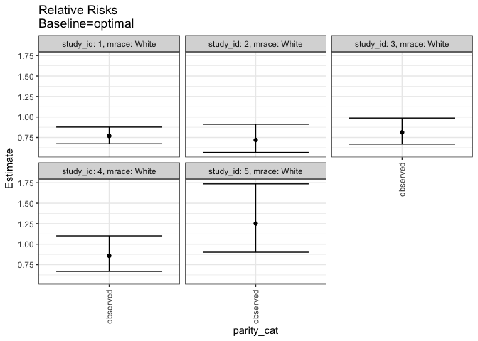

## Methods
## Outcome Variable

**Outcome Variable:** haz01

## Predictor Variables

**Intervention Variable:** parity_cat

**Adjustment Set:**

unadjusted

## Stratifying Variables

The analysis was stratified on these variable(s):

* study_id
* mrace

## Data Summary

 study_id  mrace   parity_cat    haz01   n_cell     n
---------  ------  -----------  ------  -------  ----
        1  Black   [0,1)             0        2    26
        1  Black   [0,1)             1        2    26
        1  Black   [1,2)             0        4    26
        1  Black   [1,2)             1        4    26
        1  Black   [2,3)             0        5    26
        1  Black   [2,3)             1        1    26
        1  Black   [3,13]            0        2    26
        1  Black   [3,13]            1        6    26
        1  White   [0,1)             0        7   263
        1  White   [0,1)             1       43   263
        1  White   [1,2)             0       22   263
        1  White   [1,2)             1       36   263
        1  White   [2,3)             0       24   263
        1  White   [2,3)             1       32   263
        1  White   [3,13]            0       37   263
        1  White   [3,13]            1       62   263
        2  Black   [0,1)             0        0    22
        2  Black   [0,1)             1        3    22
        2  Black   [1,2)             0        1    22
        2  Black   [1,2)             1        2    22
        2  Black   [2,3)             0        3    22
        2  Black   [2,3)             1        1    22
        2  Black   [3,13]            0        1    22
        2  Black   [3,13]            1       11    22
        2  White   [0,1)             0       14   254
        2  White   [0,1)             1       28   254
        2  White   [1,2)             0       30   254
        2  White   [1,2)             1       37   254
        2  White   [2,3)             0       26   254
        2  White   [2,3)             1       19   254
        2  White   [3,13]            0       62   254
        2  White   [3,13]            1       38   254
        3  Black   [0,1)             0        1    27
        3  Black   [0,1)             1        1    27
        3  Black   [1,2)             0        6    27
        3  Black   [1,2)             1        4    27
        3  Black   [2,3)             0        1    27
        3  Black   [2,3)             1        1    27
        3  Black   [3,13]            0        5    27
        3  Black   [3,13]            1        8    27
        3  White   [0,1)             0       16   269
        3  White   [0,1)             1       35   269
        3  White   [1,2)             0       28   269
        3  White   [1,2)             1       39   269
        3  White   [2,3)             0       23   269
        3  White   [2,3)             1       25   269
        3  White   [3,13]            0       51   269
        3  White   [3,13]            1       52   269
        4  Black   [0,1)             0        0    19
        4  Black   [0,1)             1        1    19
        4  Black   [1,2)             0        3    19
        4  Black   [1,2)             1        4    19
        4  Black   [2,3)             0        4    19
        4  Black   [2,3)             1        0    19
        4  Black   [3,13]            0        2    19
        4  Black   [3,13]            1        5    19
        4  White   [0,1)             0       17   275
        4  White   [0,1)             1       30   275
        4  White   [1,2)             0       37   275
        4  White   [1,2)             1       33   275
        4  White   [2,3)             0       24   275
        4  White   [2,3)             1       38   275
        4  White   [3,13]            0       55   275
        4  White   [3,13]            1       41   275
        5  Black   [0,1)             0        0    21
        5  Black   [0,1)             1        2    21
        5  Black   [1,2)             0        0    21
        5  Black   [1,2)             1        3    21
        5  Black   [2,3)             0        3    21
        5  Black   [2,3)             1        5    21
        5  Black   [3,13]            0        1    21
        5  Black   [3,13]            1        7    21
        5  White   [0,1)             0       21   252
        5  White   [0,1)             1       25   252
        5  White   [1,2)             0       27   252
        5  White   [1,2)             1       32   252
        5  White   [2,3)             0       19   252
        5  White   [2,3)             1       27   252
        5  White   [3,13]            0       51   252
        5  White   [3,13]            1       50   252

The following strata were considered:

* study_id: 1, mrace: Black
* study_id: 1, mrace: White
* study_id: 2, mrace: Black
* study_id: 2, mrace: White
* study_id: 3, mrace: Black
* study_id: 3, mrace: White
* study_id: 4, mrace: Black
* study_id: 4, mrace: White
* study_id: 5, mrace: Black
* study_id: 5, mrace: White

### Dropped Strata

Some strata were dropped due to rare outcomes:

* study_id: 1, mrace: Black
* study_id: 2, mrace: Black
* study_id: 3, mrace: Black
* study_id: 4, mrace: Black
* study_id: 5, mrace: Black

## Methods Detail

We're interested in the causal parameters $E[Y_a]$ for all values of $a \in \mathcal{A}$. These parameters represent the mean outcome if, possibly contrary to fact, we intervened to set all units to have $A=a$. Under the randomization and positivity assumptions, these are identified by the statistical parameters $\psi_a=E_W[E_{Y|A,W}(Y|A=a,W)]$.  In addition, we're interested in the mean of $Y$, $E[Y]$ under no intervention (the observed mean). We will estimate these parameters by using SuperLearner to fit the relevant likelihood factors -- $E_{Y|A,W}(Y|A=a,W)$ and $p(A=a|W)$, and then updating our likelihood fit using a joint TMLE.

For unadjusted analyses ($W=\{\}$), initial likelihoods were estimated using Lrnr_glm to estimate the simple $E(Y|A)$ and Lrnr_mean to estimate $p(A)$. For adjusted analyses, a small library containing Lrnr_glmnet, Lrnr_xgboost, and Lrnr_mean was used.

Having estimated these parameters, we will then use the delta method to estimate relative risks and attributable risks relative to a prespecified baseline level of $A$.

todo: add detail about dropping strata with rare outcomes, handling missingness

# Results Detail

## Results Plots
<!-- -->

<!-- -->

## Results Table

### Parameter: TSM

 study_id  mrace   intervention_level   baseline_level     estimate    ci_lower    ci_upper
---------  ------  -------------------  ---------------  ----------  ----------  ----------
        1  White   optimal              NA                0.8558355   0.7463714   0.9652996
        2  White   optimal              NA                0.6679847   0.4933976   0.8425717
        3  White   optimal              NA                0.6905730   0.5426692   0.8384768
        4  White   optimal              NA                0.6019396   0.4338274   0.7700518
        5  White   optimal              NA                0.4249466   0.2711595   0.5787337

### Parameter: E(Y)

 study_id  mrace   intervention_level   baseline_level     estimate    ci_lower    ci_upper
---------  ------  -------------------  ---------------  ----------  ----------  ----------
        1  White   observed             NA                0.6577947   0.5960367   0.7195527
        2  White   observed             NA                0.4803150   0.4153958   0.5452341
        3  White   observed             NA                0.5613383   0.4985612   0.6241154
        4  White   observed             NA                0.5163636   0.4526929   0.5800343
        5  White   observed             NA                0.5317460   0.4660920   0.5974001

### Parameter: RR

 study_id  mrace   intervention_level   baseline_level     estimate    ci_lower    ci_upper
---------  ------  -------------------  ---------------  ----------  ----------  ----------
        1  White   observed             optimal           0.7685994   0.6736738   0.8769008
        2  White   observed             optimal           0.7190509   0.5673308   0.9113451
        3  White   observed             optimal           0.8128587   0.6695315   0.9868682
        4  White   observed             optimal           0.8578330   0.6681296   1.1013992
        5  White   observed             optimal           1.2513243   0.9018313   1.7362588

### Parameter: PAR

 study_id  mrace   intervention_level   baseline_level      estimate     ci_lower     ci_upper
---------  ------  -------------------  ---------------  -----------  -----------  -----------
        1  White   optimal              NA                -0.1980408   -0.3048461   -0.0912355
        2  White   optimal              NA                -0.1876697   -0.3455831   -0.0297563
        3  White   optimal              NA                -0.1292347   -0.2625493    0.0040799
        4  White   optimal              NA                -0.0855760   -0.2364433    0.0652914
        5  White   optimal              NA                 0.1067994   -0.0316285    0.2452274

### Parameter: PAF

 study_id  mrace   intervention_level   baseline_level      estimate     ci_lower     ci_upper
---------  ------  -------------------  ---------------  -----------  -----------  -----------
        1  White   optimal              NA                -0.3010678   -0.4843979   -0.1403799
        2  White   optimal              NA                -0.3907222   -0.7626400   -0.0972792
        3  White   optimal              NA                -0.2302261   -0.4935818   -0.0133066
        4  White   optimal              NA                -0.1657281   -0.4967157    0.0920640
        5  White   optimal              NA                 0.2008467   -0.1088548    0.4240490

